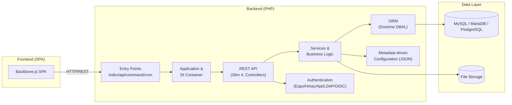

# EspoCRM — Project Overview

> **Version:** 9.2.5
> **Type:** Open-source CRM platform (AGPL-3.0-or-later)
> **Repository:** https://github.com/espocrm/espocrm

This document provides a high-level overview of the EspoCRM project: what it is, how it is organized, the technology it relies on, and the key concepts a developer or contributor should understand.

---

## 1. What is EspoCRM?

EspoCRM is a free, open-source **Customer Relationship Management (CRM)** platform. It helps organizations store, organize, and manage leads, contacts, sales opportunities, marketing campaigns, support cases, and more.

Beyond a traditional CRM, EspoCRM is designed as a **platform for building custom business applications**. It can be extended with custom entities, fields, relationships, and logic — either through configuration (metadata) or through code (modules, extensions).

### 1.1 Key Highlights

- **Open-source transparency** — Full source code available under AGPL v3.
- **Customization freedom** — Create custom entities, fields, relationships, and integrations.
- **Clean, fast UI** — A minimalist single-page application (SPA) frontend.
- **Straightforward REST API** — Easy integration with third-party systems.
- **Metadata-driven** — Most behavior is described declaratively in JSON metadata.

---

## 2. Technology Stack

| Layer            | Technology |
|------------------|------------|
| **Backend**      | PHP 8.3 – 8.5 |
| **Frontend**     | JavaScript SPA (Backbone-based, built with Grunt) |
| **Database**     | MySQL 8.0+, MariaDB 10.3+, or PostgreSQL 15+ |
| **HTTP Framework** | Slim 4 (PSR-7/15) |
| **ORM**          | Built-in ORM (`Espo\Core\ORM`) over Doctrine DBAL |
| **WebSocket**    | Ratchet (for real-time updates) |
| **Dependency Mgmt (PHP)** | Composer |
| **Dependency Mgmt (JS)**  | npm |
| **Build Tools**  | Grunt, Rollup |
| **Static Analysis** | PHPStan (level 8) |
| **Testing**      | PHPUnit (unit + integration), Jasmine (frontend) |
| **License**      | GNU AGPL v3 |

---

## 3. Repository Structure

```
espocrm/
├── application/          # Core application code (PHP)
│   └── Espo/
│       ├── Binding.php
│       ├── Classes/        # Reusable value/helper classes
│       ├── Controllers/    # Core API controllers (~69)
│       ├── Core/           # Framework: API, Auth, ORM, DI, etc.
│       ├── Entities/       # Core domain entities (~67)
│       ├── EntryPoints/    # HTTP entry points
│       ├── Hooks/          # Lifecycle hooks
│       ├── Modules/        # Bundled modules
│       │   └── Crm/        # CRM module (sales, marketing, support)
│       ├── ORM/            # ORM repository & entity base
│       ├── Repositories/   # Core repositories
│       ├── Resources/      # Config, metadata, layouts, i18n
│       ├── Services/       # Core services
│       └── Tools/          # Feature-specific tooling
├── client/               # Frontend source (JS/CSS)
├── custom/               # Custom & module overrides (PSR-4: Espo\Custom\, Espo\Modules\)
├── public/               # Web document root
│   ├── api/                # REST API entry point
│   ├── install/            # Installer
│   ├── portal/             # Portal (client portal) entry point
│   └── oauth/              # OAuth endpoints
├── schema/               # JSON Schema definitions for metadata
├── tests/                # Unit and integration tests
├── dev/                  # Development tooling
├── install/              # Installer assets
├── data/                 # Runtime data (logs, cache, config)
├── *.php                 # Entry points (see below)
├── composer.json         # PHP dependencies
├── package.json          # JS dependencies & build scripts
├── Gruntfile.js          # Frontend build configuration
└── README.md
```

---

## 4. Entry Points

The application is invoked through several root-level PHP scripts, each launching a specific **application runner**:

| File              | Runner                              | Purpose |
|-------------------|-------------------------------------|---------|
| `public/index.php`  | `Client` / `EntryPoint`              | Serves the SPA frontend or an entry point |
| `public/api/`       | (API runner via Slim)                | REST API backend |
| `command.php`       | `Command`                            | CLI command execution |
| `cron.php`          | `Cron`                               | Scheduled job processing |
| `daemon.php`        | `Daemon`                             | Daemon process |
| `websocket.php`     | `WebSocket`                          | Real-time WebSocket server |
| `rebuild.php`       | `Rebuild`                            | Rebuild the application (cache, DB) |
| `upgrade.php`       | `Upgrade`                            | System upgrades |
| `clear_cache.php`   | `ClearCache`                         | Clear cache |
| `preload.php`       | `Preload`                            | Preload services |
| `extension.php`     | `Extension`                          | Install/manage extensions |

The central bootstrap is `bootstrap.php`, which loads Composer's autoloader. The `Espo\Core\Application` class (`application/Espo/Core/Application.php`) is the application's central access point — it initializes the DI container, autoloads, and preloads, then dispatches to a runner.

---

## 5. Architecture at a Glance



### 5.1 Core Layers

- **Controllers** (`application/Espo/Controllers/`, `application/Espo/Modules/Crm/Controllers/`) — Handle HTTP requests, validate input, and delegate to services. ~69 core controllers.
- **Services** (`application/Espo/Services/`, `application/Espo/Tools/`) — Encapsulate business logic.
- **ORM** (`application/Espo/Core/ORM/`) — A custom ORM built on Doctrine DBAL; entities and repositories map to database tables.
- **Authentication** (`application/Espo/Core/Authentication/`) — Pluggable authentication: Espo, HMAC/Api, LDAP, OIDC, plus two-factor (2FA) support.
- **Metadata** — JSON configuration files under `*/Resources/metadata/` drive entity definitions, layouts, ACL, routing, and more.

---

## 6. Domain Model

EspoCRM ships a bundled **CRM module** (`application/Espo/Modules/Crm/`) with the following primary business entities:

| Entity | Description |
|--------|-------------|
| **Account** | Organizations/companies you do business with |
| **Contact** | Individual people associated with accounts |
| **Lead** | Potential customers (pre-qualification) |
| **Opportunity** | Sales deals/pipelines (with stages & amounts) |
| **Task** | Activities/to-dos |
| **Call** | Phone-call activities |
| **Meeting** | Meetings/calendar events |
| **Campaign** | Marketing campaigns |
| **TargetList** | Lists of campaign targets (contacts/leads/accounts) |
| **Target** | Standalone marketing targets |
| **Case** | Customer support cases |
| **Document** | Documents with folder organization |
| **KnowledgeBaseArticle** | Knowledge-base content |
| **MassEmail** | Mass email campaigns |
| **CampaignTrackingUrl** | Tracked campaign links |
| **CampaignLogRecord** | Campaign event log entries |
| **EmailQueueItem** | Queued outbound emails |
| **Reminder** | Activity reminders |

Core/platform entities include **User**, **Team**, **Role**, **Portal**, **Email**, **Attachment**, **Notification**, **Note** (stream), **ScheduledJob**, **Webhook**, and more (~67 core entities in total).

### 6.1 Entity Definition (Example: Account)

Entities are defined both in PHP classes and JSON metadata. For example, `Account` (`application/Espo/Modules/Crm/Entities/Account.php`) exposes typed accessors, while its fields are declared in `application/Espo/Modules/Crm/Resources/metadata/entityDefs/Account.json` (name, type, industry, emailAddress, phoneNumber, billingAddress, shippingAddress, etc.).

---

## 7. REST API

EspoCRM exposes a RESTful API from `public/api/`.

- **Routing** — Standard CRUD routes are generated automatically for each entity scope. Custom routes are declared in `routes.json` files (e.g., `application/Espo/Modules/Crm/Resources/routes.json`), referencing action classes implementing `Espo\Core\Api\Action`.
- **Schema** — The `schema/routes.json` file defines the JSON Schema for route definitions.
- **Authentication** — Token-based (Espo auth token), HMAC for API users, plus LDAP/OIDC integration.

Example custom CRM routes include calendar/activities retrieval, mass-email unsubscribe endpoints, and mail-merge generation.

---

## 8. Key Concepts

### 8.1 Metadata-Driven Design

Most application behavior is controlled by **JSON metadata** rather than code. Key metadata types:

| Directory | Purpose |
|-----------|---------|
| `entityDefs/` | Field definitions, types, relationships for entities |
| `scopes/` | Entity scope configuration (ACL, stream, layouts, etc.) |
| `clientDefs/` | Frontend view configuration |
| `layouts/` | UI layout definitions (detail, list, etc.) |
| `selectDefs/` | Search/filter configuration |
| `aclDefs/` | Access-control definitions |
| `dashlets/` | Dashboard widgets |

The `schema/` directory contains JSON Schemas that validate metadata files and enable IDE autocompletion.

### 8.2 Dependency Injection

The backend follows **SOLID principles** and relies heavily on DI. The `Espo\Core\Container` manages services, and `Espo\Core\InjectableFactory` creates objects with their dependencies injected. Bindings are declared in `Binding.php` files at the application and module level.

### 8.3 Extensibility

- **Custom namespace** (`custom/Espo/Custom/`) — Overrides and additions without touching core.
- **Modules** (`custom/Espo/Modules/`) — Self-contained feature modules.
- **Extensions** — Distributable packages installable via `extension.php` or the admin UI.

### 8.4 Frontend

The frontend is a single-page application built on **Backbone.js** with a custom build toolchain (Grunt). Source lives under `client/`. It communicates exclusively with the backend REST API.

---

## 9. Development

### 9.1 Requirements

- PHP 8.3 – 8.5
- MySQL 8.0+ / MariaDB 10.3+ / PostgreSQL 15+
- Node.js ≥ 20, npm ≥ 8 (for frontend builds)
- Composer (PHP dependencies)

### 9.2 Common Commands

| Task | Command |
|------|---------|
| Install PHP deps | `composer install` |
| Install JS deps | `npm install` |
| Build frontend | `npm run build` |
| Dev build | `npm run build-dev` |
| Static analysis | `npm run sa` (PHPStan) |
| Unit tests | `npm run unit-tests` |
| Integration tests | `npm run integration-tests` |
| Run CLI command | `php command.php <command>` |
| Run cron | `php cron.php` |
| Rebuild app | `php rebuild.php` |

### 9.3 Git Workflow

Per `README.md`, the repository uses three primary branches:

| Branch | Purpose |
|--------|---------|
| `stable` | Last stable release |
| `master` | Development branch; new features |
| `fix` | Upcoming maintenance release; minor fixes |

---

## 10. Documentation & Community

- **Official docs:** https://docs.espocrm.com (admin, user, developer guides)
- **Demo:** https://www.espocrm.com/demo/
- **Community forum:** https://forum.espocrm.com
- **Bug reports:** GitHub Issues
- **Translations:** POEditor project

---

## 11. License

EspoCRM is licensed under the **GNU Affero General Public License v3** (AGPL-3.0-or-later). See `LICENSE.txt`.

Contributions require accepting the CLA at https://github.com/espocrm/cla.
